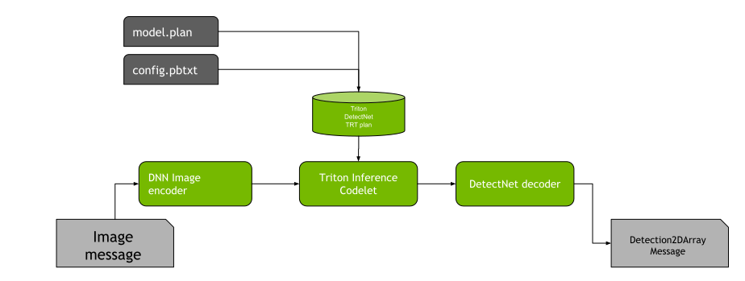

# Isaac ROS Object Detection

<div align="center"></div>

## Overview
This repository provides a GPU-accelerated package for object detection based on [DetectNet](https://developer.nvidia.com/blog/detectnet-deep-neural-network-object-detection-digits/). Using a trained deep-learning model and a monocular camera, the `isaac_ros_detectnet` package can detect objects of interest in an image and provide bounding boxes. DetectNet is similar to other popular object detection models such as YOLOV3, FasterRCNN, SSD, and others while being efficient with multiple object classes in large images.

### ROS2 Graph Configuration

To run the DetectNet object detection inference, the following ROS2 nodes should be set up and running:



1. **Isaac ROS DNN Image encoder**: This will take an image message and convert it to a tensor ([`TensorList`](https://github.com/NVIDIA-ISAAC-ROS/isaac_ros_common/blob/main/isaac_ros_tensor_list_interfaces/msg/TensorList.msg) that can be
   processed by the network.
2. **Isaac ROS DNN Inference - Triton**: This will execute the DetectNet network and take as input the tensor from the DNN Image Encoder. 
    > **Note:** The [Isaac ROS TensorRT](https://github.com/NVIDIA-ISAAC-ROS/isaac_ros_dnn_inference/tree/main/isaac_ros_tensor_rt) package is not able to perform inference with DetectNet models at this time.
  
   The output will be a TensorList message containing the encoded detections. Use the parameters `model_name` and `model_repository_paths` to point to the model folder and set the model name. The `.plan` file should be located at `$model_repository_path/$model_name/1/model.plan`
3. **Isaac ROS Detectnet Decoder**: This node will take the TensorList with encoded detections as input, and output `Detection2DArray` messages for each frame. See the following section for the parameters.

## Table of Contents
- [Isaac ROS Object Detection](#isaac-ros-object-detection)
  - [Overview](#overview)
    - [ROS2 Graph Configuration](#ros2-graph-configuration)
  - [Table of Contents](#table-of-contents)
  - [Latest Update](#latest-update)
  - [Supported Platforms](#supported-platforms)
    - [Docker](#docker)
  - [Quickstart](#quickstart)
  - [Next Steps](#next-steps)
    - [Try More Examples](#try-more-examples)
    - [Use Different Models](#use-different-models)
    - [Customize your Dev Environment](#customize-your-dev-environment)
  - [Package Reference](#package-reference)
    - [`isaac_ros_detectnet`](#isaac_ros_detectnet)
      - [Usage](#usage)
      - [ROS Parameters](#ros-parameters)
      - [ROS Topics Subscribed](#ros-topics-subscribed)
      - [ROS Topics Published](#ros-topics-published)
  - [Troubleshooting](#troubleshooting)
    - [Isaac ROS Troubleshooting](#isaac-ros-troubleshooting)
    - [Deep Learning Troubleshooting](#deep-learning-troubleshooting)
  - [Updates](#updates)

## Latest Update
Update 2022-06-30: Support for ROS2 Humble and miscellaneous bug fixes

## Supported Platforms
This package is designed and tested to be compatible with ROS2 Humble running on [Jetson](https://developer.nvidia.com/embedded-computing) or an x86_64 system with an NVIDIA GPU.


| Platform | Hardware                                                                                                                                                                                                | Software                                                                                                             | Notes                                                                                                                                                                                   |
| -------- | ------------------------------------------------------------------------------------------------------------------------------------------------------------------------------------------------------- | -------------------------------------------------------------------------------------------------------------------- | --------------------------------------------------------------------------------------------------------------------------------------------------------------------------------------- |
| Jetson   | [Jetson Orin](https://www.nvidia.com/en-us/autonomous-machines/embedded-systems/jetson-orin/)<br/>[Jetson Xavier](https://www.nvidia.com/en-us/autonomous-machines/embedded-systems/jetson-agx-xavier/) | [JetPack 5.0.1 DP](https://developer.nvidia.com/embedded/jetpack)                                                    | For best performance, ensure that [power settings](https://docs.nvidia.com/jetson/archives/r34.1/DeveloperGuide/text/SD/PlatformPowerAndPerformance.html) are configured appropriately. |
| x86_64   | NVIDIA GPU                                                                                                                                                                                              | [Ubuntu 20.04+](https://releases.ubuntu.com/20.04/) <br> [CUDA 11.6.1+](https://developer.nvidia.com/cuda-downloads) |


### Docker
To simplify development, we strongly recommend leveraging the Isaac ROS Dev Docker images by following [these steps](https://github.com/NVIDIA-ISAAC-ROS/isaac_ros_common/blob/main/docs/dev-env-setup.md). This will streamline your development environment setup with the correct versions of dependencies on both Jetson and x86_64 platforms.

> **Note:** All Isaac ROS Quickstarts, tutorials, and examples have been designed with the Isaac ROS Docker images as a prerequisite.

## Quickstart
1. Set up your development environment by following the instructions [here](https://github.com/NVIDIA-ISAAC-ROS/isaac_ros_common/blob/main/docs/dev-env-setup.md).
2. Clone this repository and its dependencies under `~/workspaces/isaac_ros-dev/src`.

    ```bash
    cd ~/workspaces/isaac_ros-dev/src
    ```

    ```bash
    git clone https://github.com/NVIDIA-ISAAC-ROS/isaac_ros_object_detection
    ```

    ```bash
    git clone https://github.com/NVIDIA-ISAAC-ROS/isaac_ros_dnn_inference
    ```

    ```bash
    git clone https://github.com/NVIDIA-ISAAC-ROS/isaac_ros_nitros
    ```

    ```bash
    git clone https://github.com/NVIDIA-ISAAC-ROS/isaac_ros_common
    ```

3. Pull down a ROS Bag of sample data:
    ```bash
    cd ~/workspaces/isaac_ros-dev/src/isaac_ros_object_detection/isaac_ros_detectnet && \
      git lfs pull -X "" -I "resources/rosbags"
    ```
4. Launch the Docker container using the `run_dev.sh` script:
    ```bash
    cd ~/workspaces/isaac_ros-dev/src/isaac_ros_common && \
      ./scripts/run_dev.sh
    ```
5. Inside the container, build and source the workspace:
    ```bash
    cd /workspaces/isaac_ros-dev && \
      colcon build --symlink-install && \
      source install/setup.bash
    ```
6. (Optional) Run tests to verify complete and correct installation:
    ```bash
    colcon test --executor sequential
    ```
7. In this package, you will find a pre-trained DetectNet model that was trained solely for detecting tennis balls using the described simulation method. Please use this model only for verification or exploring the pipeline.

   > **Note**: Do not use this tennis ball detection model in a production environment.

   Run the following shell script to setup the pre-trained DetectNet model **inside the Docker container**:

   ```bash
   cd /workspaces/isaac_ros-dev/src/isaac_ros_object_detection && \
     ./isaac_ros_detectnet/scripts/setup_demo.sh
   ```

8. Run the following launch file to spin up a demo of this package:

    ```bash
    cd /workspaces/isaac_ros-dev && \
      ros2 launch isaac_ros_detectnet isaac_ros_detectnet_demo.launch.py
    ```
9.  Visualize and validate the output of the package in the `rqt_image_view` window. After about a minute, your output should look like this:

    

## Next Steps
### Try More Examples
To continue your exploration, check out the following suggested examples:
- [Train new `Detectnet` models in simulation](docs/training-detectnet-model-in-sim.md)

### Use Different Models
Click [here](https://github.com/NVIDIA-ISAAC-ROS/isaac_ros_dnn_inference/blob/main/docs/model-preparation.md) for more information about how to use NGC models.

This package only supports models based on the `Detectnet_v2` architecture. Some of the [supported DetectNet models](https://catalog.ngc.nvidia.com/?filters=&orderBy=scoreDESC&query=DetectNet) from NGC:

| Model Name                                                                      | Use Case                                               |
| ------------------------------------------------------------------------------- | ------------------------------------------------------ |
| [TrafficCamNet](https://ngc.nvidia.com/catalog/models/nvidia:tao:trafficcamnet) | Detect and track cars                                  |
| [PeopleNet](https://ngc.nvidia.com/catalog/models/nvidia:tao:peoplenet)         | People counting, heatmap generation, social distancing |
| [DashCamNet](https://ngc.nvidia.com/catalog/models/nvidia:tao:dashcamnet)       | Identify objects from a moving object                  |
| [FaceDetectIR](https://ngc.nvidia.com/catalog/models/nvidia:tao:facedetectir)   | Detect faces in a dark environment with IR camera      |


### Customize your Dev Environment
To customize your development environment, reference [this guide](https://github.com/NVIDIA-ISAAC-ROS/isaac_ros_common/blob/main/docs/modify-dockerfile.md).

## Package Reference
### `isaac_ros_detectnet`
#### Usage

```bash
ros2 launch isaac_ros_detectnet isaac_ros_detectnet.launch.py queue_size:=<size of the buffer> label_names:=<list of labels> coverage_threshold:=<minimum coverage value> bounding_box_scale:=<bounding box normalization value> bounding_box_offset:=<XY offset for bounding box> eps:=<epsilon distance> min_boxes:=<minimum returned boxes> enable_athr_filter:=<area-to-hit-ratio filter> threshold_athr:=<area-to-hit ratio threshold> clustering_algorithm:=<choice of clustering algorithm>
```

#### ROS Parameters

| ROS Parameter          | Type          | Default | Description                                                                                                                                                                                                             |
| ---------------------- | ------------- | ------- | ----------------------------------------------------------------------------------------------------------------------------------------------------------------------------------------------------------------------- |
| `queue_size`           | `int`         | `10`    | Size of buffer for incoming detection tensors.                                                                                                                                                                          |
| `label_names`          | `string list` | `[]`    | A list of strings with the names of the classes in the order they are used in the model. Keep the order of the list consistent with the training configuration. <br/> E.g. `['nvidia_mug', 'car']`                      |
| `coverage_threshold`   | `float`       | `0.6`   | A minimum coverage value for the boxes to be considered. Bounding boxes with lower value than this will not be in the output.                                                                                           |
| `bounding_box_scale`   | `float`       | `35.0`  | The scale parameter, which should match the training configuration.                                                                                                                                                     |
| `bounding_box_offset`  | `float`       | `0.5`   | Bounding box offset for both X and Y dimensions.                                                                                                                                                                        |
| `eps`                  | `float`       | `0.01`  | Epsilon value to use.                                                                                                                                                                                                   |
| `min_boxes`            | `int`         | `1`     | The minimum number of boxes to return.                                                                                                                                                                                  |
| `enable_athr_filter`   | `int`         | `0`     | Enables the area-to-hit ratio (ATHR) filter. The ATHR is calculated as: **ATHR = sqrt(clusterArea) / nObjectsInCluster.**                                                                                               |
| `threshold_athr`       | `float`       | `0.0`   | The `area-to-hit` ratio threshold.                                                                                                                                                                                      |
| `clustering_algorithm` | `int`         | `1`     | The clustering algorithm selection. (`1`: Enables DBScan clustering, `2`: Enables Hybrid clustering, resulting in more boxes that will need to be processed with NMS or other means of reducing overlapping detections. |

#### ROS Topics Subscribed
| ROS Topic    | Interface                                                                                                                                                         | Description                                                     |
| ------------ | ----------------------------------------------------------------------------------------------------------------------------------------------------------------- | --------------------------------------------------------------- |
| `tensor_sub` | [isaac_ros_tensor_list_interfaces/TensorList](https://github.com/NVIDIA-ISAAC-ROS/isaac_ros_common/blob/main/isaac_ros_tensor_list_interfaces/msg/TensorList.msg) | The tensor that represents the inferred aligned bounding boxes. |

#### ROS Topics Published
| ROS Topic              | Interface                                                                                                        | Description                                        |
| ---------------------- | ---------------------------------------------------------------------------------------------------------------- | -------------------------------------------------- |
| `detectnet/detections` | [vision_msgs/Detection2DArray](https://github.com/ros-perception/vision_msgs/blob/ros2/msg/Detection2DArray.msg) | Aligned image bounding boxes with detection class. |


## Troubleshooting
### Isaac ROS Troubleshooting
For solutions to problems with Isaac ROS, please check [here](https://github.com/NVIDIA-ISAAC-ROS/isaac_ros_common/blob/main/docs/troubleshooting.md).

### Deep Learning Troubleshooting
For solutions to problems with using DNN models, please check [here](https://github.com/NVIDIA-ISAAC-ROS/isaac_ros_dnn_inference/blob/main/docs/troubleshooting.md).

## Updates
| Date       | Changes                                             |
| ---------- | --------------------------------------------------- |
| 2022-06-30 | Support for ROS2 Humble and miscellaneous bug fixes |
| 2022-03-21 | Initial release                                     |
